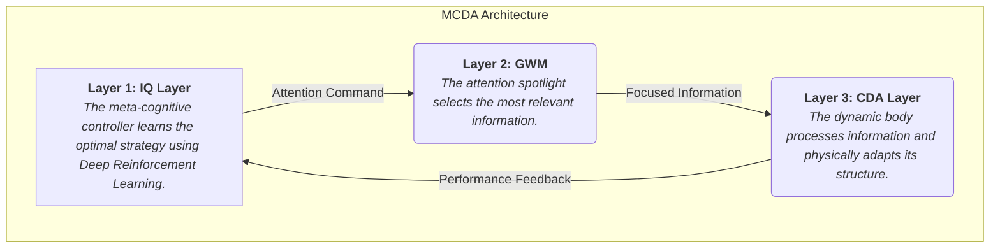

# 🧠 معماری فراشناختی پویا (Meta-Cognitive Dynamic Architecture - MCDA)

A research project by Ramyar Azak to design and implement a novel, neuroscience-inspired AI architecture from scratch.

## Introduction & Goal

Standard AI architectures, despite their power, face fundamental limitations in areas like **continual learning** and **causal reasoning**. This project introduces the Meta-Cognitive Dynamic Architecture (MCDA), a new design aimed at overcoming these challenges. The MCDA is a dynamic, self-organizing system that adapts its own physical structure in response to new tasks and data, moving closer to the principles of biological intelligence.

## Core Architectural Concept

The MCDA is built on a three-layer hierarchical control system. A high-level strategic controller (IQ Layer) guides the focus of a low-level, physically adaptive processing body (CDA Layer) through an attention mechanism (GWM).



## Architectural Components

### Layer 3: Cortical Dynamic Architecture (CDA)
This is the physical processing layer of the network. Unlike static networks, its structure is constantly evolving.
* **I-Neurons (Integrator-Neurons):** The primary processing units, based on the Leaky Integrate-and-Fire model.
* **M-Neurons (Modulator-Neurons):** These are the "internal architects" of the network. They observe the activity of I-Neurons and intelligently decide to **create** new connections or **prune** inefficient ones. This core feature is known as **Structural Plasticity**.

### Layer 2: Global Workspace Module (GWM)
This module acts as the system's **focus mechanism**. Following commands from the IQ Layer, the GWM selects a single stream of information from multiple inputs and broadcasts it to the entire CDA Layer for unified processing.

### Layer 3: IQ Layer (Meta-Cognitive Controller)
This is the "brain of the brain." It does not process raw data. Instead, it uses **Deep Q-Learning (DQN)** to learn a long-term strategy. Its goal is to guide the GWM's attention to maximize the overall "IQ" of the system, which is a function of accuracy, efficiency, and adaptability.

## How to Use

This project is modular, allowing the `MCDA` architecture to be imported and used in various reinforcement learning environments.

### 1. Prerequisites
Ensure you have the required Python libraries installed:
```bash
pip install torch numpy
```

### 2. Basic Usage
Save the `mcda_architecture.py` file in your project directory. You can then import and instantiate the architecture as follows:

```python
from mcda_architecture import MCDA

# Define the parameters for your environment
STATE_SIZE = 2
NUMBER_OF_POSSIBLE_ACTIONS = 5
INPUT_VECTOR_SIZE = 10
CDA_LAYER_NEURONS = 30

# Initialize the complete MCDA system
system = MCDA(
    state_size=STATE_SIZE,
    num_actions=NUMBER_OF_POSSIBLE_ACTIONS,
    num_inputs=INPUT_VECTOR_SIZE,
    cda_neurons=CDA_LAYER_NEURONS
)

print("✅ MCDA system initialized successfully and is ready for training.")
```

### 3. Example Project
A complete training loop is demonstrated in the `main_experiment_py.py` file. In that example, the MCDA is trained on the **Multi-Armed Bandit** problem, where it successfully learns to identify the optimal action to maximize its reward. This serves as a proof-of-concept for the architecture's learning capabilities.

---
